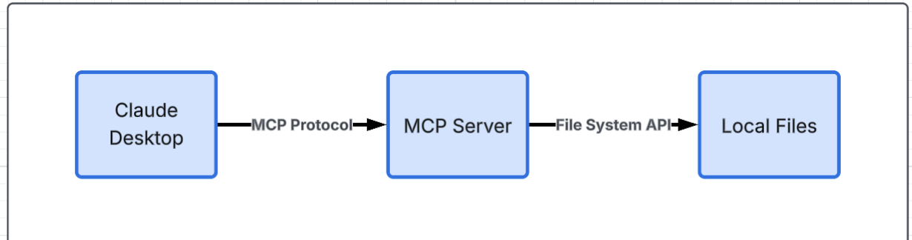

# 🛠️ MCP File Assistant Workshop

> Hands on workshop teaching +40 developers to build their first AI-powered file assistant using Model Context Protocol.

**Presented at Build Club Brisbane, December 10, 2025**

## 📚 Workshop Materials

| Resource | Description |
|----------|-------------|
| 📊 [MCP Slides](./docs/MCP_WORKSHOP.pdf) | Complete workshop presentation |
| 🎥 [Demo Video](#demo-video) | 10-minute walkthrough of the MCP server in action |

## 🎯 What This Workshop Teaches

Attendees learn to build an MCP server that enables AI assistants (like Claude) to intelligently interact with local files - reading, searching, and organizing documents.

## 🏗️ Architecture



## 🛠️ Tech Stack
- Python 3.11+
- MCP SDK
- File system operations
- Semantic search capabilities

## 📚 Workshop Structure

### Part 1: MCP Fundamentals (15 min)
- What is Model Context Protocol?
- Why MCP vs traditional APIs?
- Use cases for file management

### Part 2: Build the Server (20 min)
- Initialize MCP server
- Implement file operations
- Add search capabilities

### Part 3: Integration & Testing (10 min)
- Connect to Claude Desktop
- Test file operations
- Debug common issues

## 💡 Key Learning Outcomes
- Understand MCP protocol basics
- Build production-ready MCP server
- Integrate AI with local file systems
- Handle errors and edge cases

## 🚀 Quick Start

### Step 1: Get the Code
```bash
git clone https://github.com/EllaFerreira/mcp-file-assistant-workshop.git
cd mcp-file-assistant-workshop
```

### Step 2: Install Everything
```bash
# This step creates a virtual environment
uv venv

# Activate it
source .venv/bin/activate     # Mac/Linux
.venv\Scripts\activate        # Windows

# Install dependencies
uv pip install -e .
```

### Step 3: Find Your Full Path
```bash
pwd    # Mac/Linux
cd     # Windows
```
**Copy this path!** You'll need it in the next step ©

### Step 4: Connect to Claude Desktop

Make sure you have Claude Desktop installed, [click here](https://www.claude.com/download).

**Find the config file:**
- **Mac:** Open `~/Library/Application Support/Claude/claude_desktop_config.json`
- **Windows:** Open `%APPDATA%\Claude\claude_desktop_config.json`
- **Linux:** Open `~/.config/Claude/claude_desktop_config.json`

**Add this (replace YOUR_PATH with the path you copied):**

```json
{
  "mcpServers": {
    "file-assistant": {
      "command": "YOUR_PATH/.venv/bin/python",
      "args": [
        "YOUR_PATH/file_assistant/server.py"
      ]
    }
  }
}
```

**Example:**
```json
{
  "mcpServers": {
    "file-assistant": {
      "command": "/Users/EllaFerreira/mcp-file-assistant-workshop/.venv/bin/python",
      "args": [
        "/Users/EllaFerreira/mcp-file-assistant-workshop/file_assistant/server.py"
      ]
    }
  }
}
```

### Step 5: Restart Claude Desktop
- Quit Claude completely (⌘Q on Mac)
- Open it again
- Look for a settings icon at the bottom left of the window

---

## 🎓 Taught By
Ella Ferreira, City Lead @ Build Club Brisbane
- Software Engineer @ Montu
- 5 years full-stack + AI integration experience

## Learn More About MCP

- 📚 [Official MCP Docs](https://modelcontextprotocol.io/)
- 🐍 [Python SDK](https://github.com/modelcontextprotocol/python-sdk)
- 💬 [Community Discord](https://discord.com/invite/model-context-protocol-1312302100125843476)
- 🎓 [More Examples](https://github.com/modelcontextprotocol/servers)


**Built with ❤️ for Build Club Brisbane**

Happy coding! 👩🏻‍💻
